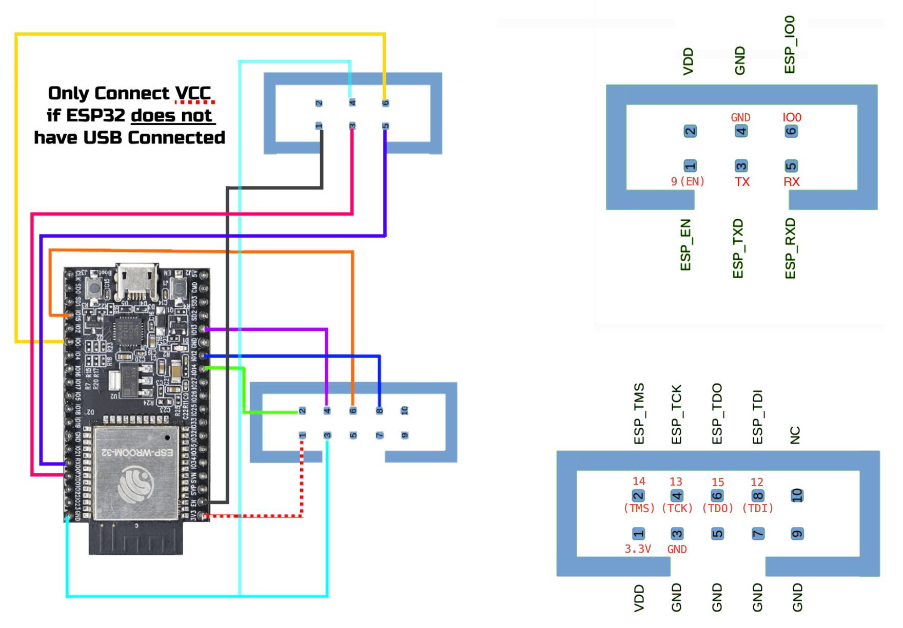

# ESP-Prog Debugging in VSCode Sample Repo

This is an example repository to quickly get you debugging an ESP32-based dev
board with the ESP-Prog programmer in VSCode.

## Features

Includes VSCode tasks out of the box for:
  - Building firmware
  - Flashing firmware to your device
  - Debugging firmware integrated in VSCode
  - Monitoring your device over serial
  - Cleaning your build folder

## How To Use This Repo

### New Project

If you are starting a new project from scratch you can clone this repo directly
and use it as a bare bones base to build on top of. After cloning, follow the
instructions under the **Setup** and **Configuration** sections below.

### Add To Existing Project

If you already have an existing ESP32 firmware project setup in VSCode it is
very simple to integrate pieces of this repository into your project. The core
functionality to enable debugging is provided by 3 files in the **.vscode** folder.

- **launch.json** - Contains the debug configuration
- **settings.json** - Contains environment-specific paths to various tools
required for building and debugging
- **tasks.json** - Defines tasks for building, flashing, monitoring, and debugging

If you don't have any of these files in your existing repo simply copy all of
them into your **.vscode** folder. If you have a **launch.json** file I highly
recommend you simply replace it with the file in this repo.

If you already have a `launch.json`, `settings.json`, or `tasks.json` file, then
you can simply add the contents from the corresponding files in this repo to
yours.

## Setup

### Install VSCode Dependencies

```none
Name: C/C++
Id: ms-vscode.cpptools
Description: C/C++ IntelliSense, debugging, and code browsing.
Version: 1.9.7
Publisher: Microsoft
VS Marketplace Link: https://marketplace.visualstudio.com/items?itemName=ms-vscode.cpptools
```

### Clone the ESP-IDF Repo

If you don't already have it you will need to clone the ESP-IDF repo to a location
of your choice on your machine. You will need the path to this location later on.

```sh
git clone --recursive https://github.com/espressif/esp-idf.git -b v5.0
```

> _**NOTE:** If branch does not exist yet, then simply use `main` (v5.0 and
> higher required for M1 Mac support)._

### Install the ESP-IDF Toolchain

The configuration instructions below assume you have already installed the
ESP-IDF toolchain. Instructions for installing the toolchain can be found here.

[Set Up The Tools](https://docs.espressif.com/projects/esp-idf/en/latest/esp32/get-started/index.html#step-3-set-up-the-tools)

### Python 2 Dependencies

Due to [some issues with Python versions in the ESP-IDF tooling](https://github.com/espressif/esp-idf/issues/5284#issuecomment-693426699),
you must have the Python 2.7 dependencies installed on your machine even if
you have configured ESP-IDF to use Python 3.

On Linux, you may install `libpython2.7` with the following command.

```sh
sudo apt-get install libpython2.7
```

## Configuration

To configure the tasks and debug configuration there are a few tweaks you need
to make to the files in the **.vscode** directory as follows.

### settings.json

- **esp_idf_path** - The ESP IDF path is set in $IDF_PATH after running `. export.sh` (default: `~/esp/esp-idf`).

  The value in `esp_idf_path` has been defaulted based on the instructions
  provided by ESP regarding tool installation. see:
  https://docs.espressif.com/projects/esp-idf/en/latest/esp32/get-started/index.html#step-3-set-up-the-tools

### launch.json

If you cloned this repository directly to start a new project this file does
not need to be changed. Proceed to the next section.

If you added this file to an existing project you need to change the **target**
attribute to point to the `.elf` file created during a firmware build. It will
be named based on what you call your project in the top-level `CMakeLists.txt`
file.

### tasks.json

No changes need to be made to this file.

## Debugging Instructions

**ESP-Prog Connector Pinout Diagram:**



1. Attach the ESP-Prog to your target device via whatever JTAG cable is required.
1. Plug the target device (the one you want to debug) into your computer.
1. Click **Terminal > Run Tasks...** to open the Task list in VSCode and select
_Flash and Monitor Device_.
1. The device should successfully flash and start showing serial output, if applicable.
1. Plug the ESP-Prog into your computer. The red LED should illuminate.
1. Start a debug session with **F5** or **Run->Start Debugging** from the menu.

### Done 🤩

From this state you can makes changes and flash new firmware. Starting a new
debug session will reset and halt your device at your application entry point.

### It Stopped Working, Now What? 😞

I've found this to be a very reliable approach to debugging my ESP32 device.
However, occasionally things will stop working and it won't be clear why. The
'ol "turn it off and back on again" is pretty effective here. To fix almost any
issues:

1. Make sure the debugger is stopped by hitting the Red square from the debug
panel, hitting **Shift-F5** or **Run->Stop Debugging** from the menu.
1. Stop OpenOCD by focusing the OpenOCD shell output window and hitting **Ctrl-C**.
1. Try to start debugging again.

If you get the following error when trying to flash your device:

```none
A fatal error occurred: Timed out waiting for packet content
CMake Error at run_cmd.cmake:14 (message):
  esptool.py failed
Call Stack (most recent call first):
  run_esptool.cmake:21 (include)
```

This can be due to the IDF not correctly identifying your target device during
the original port scan (i.e. the wrong `/dev/ttyXXX` device). Both the ESP32
target device, as well as the ESP-Prog, will enumerate as `/dev/ttyUSB0`
(depending on whichever was plugged in first). Since the debug commands scan for
the target device port in ascending order, it can be helpful if you plug in the
target device first.

Another thing to try is to disconnect your ESP-Prog and try to flash your device
without the ESP-Prog connected. After successful flash, you can reconnect the
ESP-Prog to your computer.

## **-----> A Note on Versions <-----**

The main branch of this repo is configured to work with version 5.0 of ESP-IDF.
If you are using a different version of IDF it is very likely that paths in the
**settings.json** file will need to be altered to match the various toolchain
versions.

## Donate a Burrito

This information is the result of hours upon hours of research and trial and
error and is provided free to the community to hopefully help other ESP32 makers.
That said, if you found this helpful or if it saved you time and you wanna say
thanks in the form of a burrito, well, I'm not gonna stop you.

[Buy Me a Burrito](https://www.buymeacoffee.com/kevinsidwar) 🌯🌯🌯
